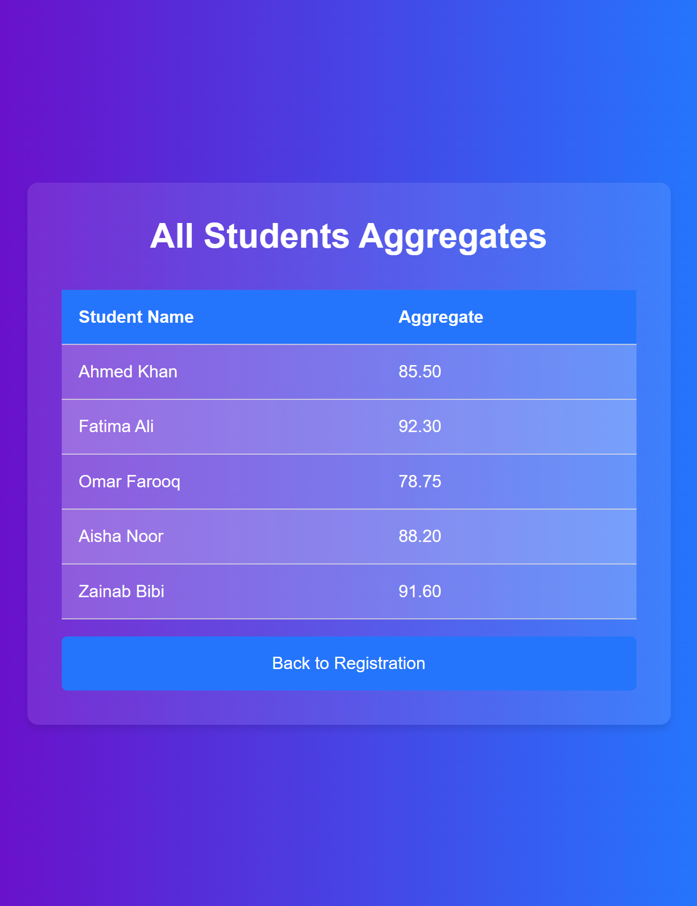

# Uni-Aggregate-Calculator 📊

A simple yet effective web application to calculate the university admission aggregate. Enter your academic details, and find out if you're eligible for admission based on your aggregate percentage.

## Features ✨

- **Responsive Design**: Works seamlessly on all devices.
- **Simple Interface**: Easy-to-use form for inputting credentials.
- **Result Storage**: View all previous calculations on a dedicated results page.
- **Eligibility Check**: Immediate feedback on admission eligibility based on aggregate.

## Technologies Used 🛠️

- **HTML**
- **CSS**
- **JavaScript**

## How It Works 🚀

1. **Enter Your Details**: Input your name, roll number, matric marks, FSC marks, and entry test marks.
2. **Calculate Aggregate**: The app calculates your aggregate based on predefined weightage.
3. **Check Eligibility**: Instant feedback on whether you are eligible for admission.
4. **View All Results**: Go to the results page to see all the previous aggregates calculated.

## Project Screenshots 🖼️

**1. Aggregate Calculation Page:**

_Enter your details to calculate the aggregate._

**2. Results Page:**

_View all previous results and aggregates calculated by other students._

## Getting Started 📝

To run this project locally:

1. Clone the repository:
   ```bash
   git clone https://github.com/Abdur-Rehman-643/Uni-Aggregate-Calculator.git
   ```
